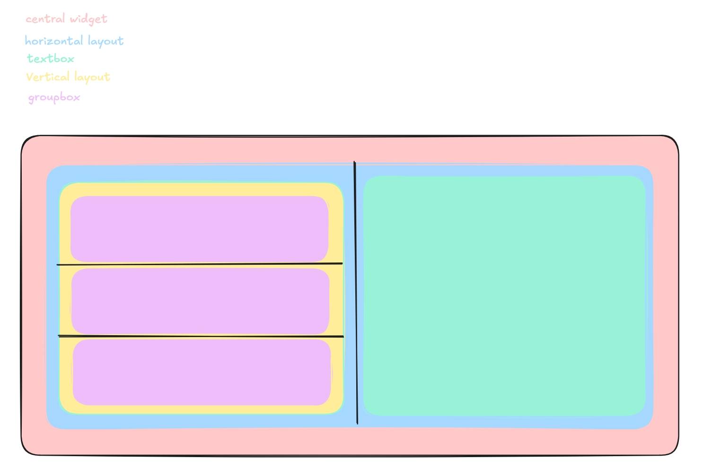
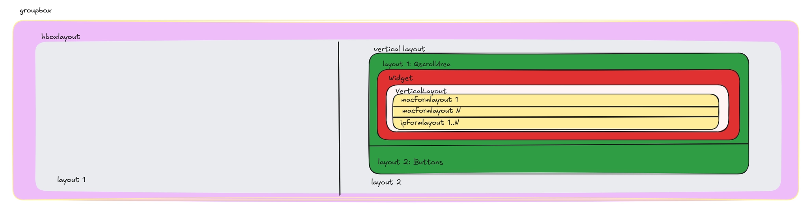

Just trying to create a Config Helper using PySide6 in Python. 
Main goal is to help quickly spew MP-BGP configs using fewest possible inputs which I'd use with different networking labs.
Trying to integerate openconfig for vendor neutrality

*** Ref Images for Architecture ***

